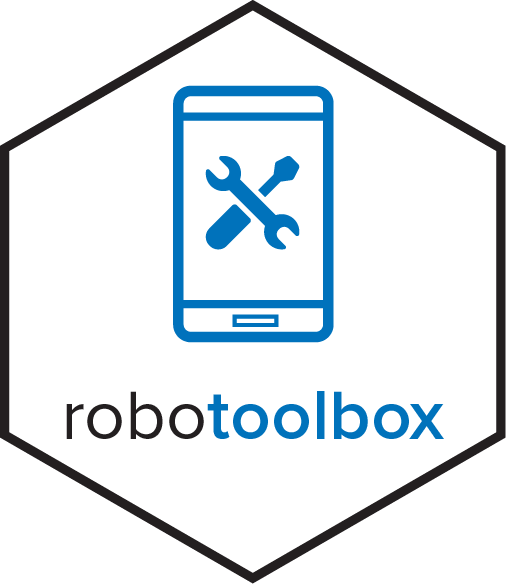

<!-- README.md is generated from README.Rmd. Please edit that file -->

# robotoolbox 

[](https://www.repostatus.org/#active)
[](https://gitlab.com/dickoa/robotoolbox/-/pipelines)
[](https://app.codecov.io/gl/dickoa/robotoolbox)
[](https://CRAN.R-project.org/package=robotoolbox)
[](https://opensource.org/license/mit/)

`robotoolbox` is an R client to access data from
[KoboToolbox](https://www.kobotoolbox.org/).

## Installation

The package is available on CRAN, Gitlab (dev) and Github (mirror).

### Install robotoolbox from CRAN

``` r
install.packages("robotoolbox")
```

### Install robotoolbox from Gitlab

you will need the [`remotes`](https://github.com/r-lib/remotes) package
to install it from Gitlab.

``` r
## install.packages("remotes")
remotes::install_gitlab("dickoa/robotoolbox")
```

### Install robotoolbox from Github

You can use `remotes::install_github` or the
[`pak`](https://github.com/r-lib/pak) package to install it from Github.

``` r
## install.packages("pak")
pak::pkg_install("dickoa/robotoolbox")
```

## robotoolbox: A quick tutorial

The `robotoolbox` package is a client to
[`KoboToolbox API v2`](https://support.kobotoolbox.org/api.html). You
will need to set your API token and specify the `KoboToolbox` server
URL. The easiest way to set up `robotoolbox` is to store the token and
the URL in your `.Renviron` file, which is automatically read by `R` on
startup.

### Getting the API token

You can retrieve your `API token` by following the instruction in the
official API documentation: <https://support.kobotoolbox.org/api.html>.

You can also get your token directly from `R` using the `kobo_token`
function.

The following examples will utilize UNHCR `KoboToolbox` server url
(<https://kobo.unhcr.org/>). You can replace this URL with
<https://kf.kobotoolbox.org/>, <https://kobo.humanitarianresponse.info/>
or any other `KoboToolbox` server URL you typically use.

``` r
kobo_token(username = "xxxxxxxxx",
           password = "xxxxxxxxx",
           url = "https://kobo.unhcr.org")
```

### Setting up Your Session

You can either edit directly the `.Renviron` file or access it by
calling `usethis::edit_r_environ()` (assuming you have the `usethis`
package installed) and entering the following two lines:

``` bash
KOBOTOOLBOX_URL="https://kobo.unhcr.org/"
KOBOTOOLBOX_TOKEN=xxxxxxxxxxxxxxxxxxxxxxxxxx
```

Or use directly the `kobo_setup` function

``` r
kobo_setup(url = "https://kobo.unhcr.org",
           token = "xxxxxxxxxxxxxxxxxxxxxxxxxx")
```

You can check the settings using the `kobo_settings` function.

``` r
library("robotoolbox")
kobo_settings()
## <robotoolbox settings>
##    KoboToolbox URL: https://kobo.unhcr.org/
##    KoboToolbox API Token: xxxxxxxxxxxxxxxxxxxxxxxxxx
```

With the settings done, it is possible to list all `assets` (e.g
surveys, questions, etc) for the account associated to the token and
URL.

### Accessing data

``` r
library("dplyr")
l <- kobo_asset_list()
l
# A tibble: 24 x 7
   uid     name     asset_type owner_username date_created
   <chr>   <chr>    <chr>      <chr>          <dttm>
 1 b9kgvd… Proj_A1… survey     xxxxxxxxxxxxx… 2020-04-27 20:34:23
 2 aRFJMp… Proj_A2… survey     xxxxxxxxxxxxx… 2020-04-27 21:21:12
 3 a6qMG7… Proj_A3… survey     xxxxxxxxxxxxx… 2021-05-25 16:59:08
 4 azhrVs… Proj_A4… survey     xxxxxxxxxxxxx… 2021-05-25 13:59:46
 5 aReR58… Proj_A5… survey     xxxxxxxxxxxxx… 2021-06-07 09:15:53
 6 aWaoqy… Proj_A6… survey     xxxxxxxxxxxxx… 2021-05-29 10:46:09
 7 aABU3C… Proj_A7… survey     xxxxxxxxxxxxx… 2020-11-28 15:00:10
 8 aaznyX… Proj_A9… survey     xxxxxxxxxxxxx… 2020-11-28 14:28:48
 9 aCVr2Q… Proj_A9… survey     xxxxxxxxxxxxx… 2021-05-25 13:30:24
10 aPxNao… Proj_A10… survey    xxxxxxxxxxxxx… 2020-04-27 11:37:34
# … with 14 more rows, and 3 more variables:
#   date_modified <dttm>, submissions <int>
glimpse(l)
$ uid            <chr> "b9kgvd7AXQCmo5qyUOBEl", "aRfJMpTSGRLzZ…"
$ name           <chr> "Proj_A1", "Proj_A2", "Proj_A3", "Proj_A…"
$ asset_type     <chr> "survey", "survey", "survey", "survey", …
$ owner_username <chr> "xxxxxxxxxxxxxx", "xxxxxxxxxxxxxxx", "xx…"
$ date_created   <dttm> 2020-04-27 20:34:23, 2020-04-27 21:21:1…
$ date_modified  <dttm> 2021-06-17 01:52:57, 2021-06-17 01:52:5…
$ submissions    <int> 2951, 2679, 2, 1, 0, 0, 287, 73, 0, 274,…
```

The list of `assets` is a `tibble`, you can filter it to select the form
unique identifier `uid` that uniquely identify the API asset you want to
open. The function `kobo_asset` can then be used to get the `asset` from
the `uid`.

``` r
uid <- l |>
  filter(name == "proj_A1") |>
  pull(uid) |>
  first()
uid
## b9agvd9AXQCmo5qyUOBEl

asset <- kobo_asset(uid)
asset
## <robotoolbox asset>  b9agvd9AXQCmo5qyUOBEl
##   Asset Name: proj_A1
##   Asset Type: survey
##   Created: 2021-05-10 07:47:53
##   Last modified: 2021-08-16 12:35:50
##   Submissions: 941
```

Now with the selected `asset`, we can extract the `submissions` using
the `kobo_submissions` function. The `kobo_data` can also be used, it’s
an alias of `kobo_submissions`.

``` r
df <- kobo_submissions(asset) ## or df <-  kobo_data(asset)
glimpse(df)
## Rows: 941
## Columns: 17
## $ id                                                         <int> …
## $ start                                                      <dttm> …
## $ end                                                        <dttm> …
## $ today                                                      <date> …
## $ deviceid                                                   <chr> …
## $ test                                                       <chr+lbl> …
## $ round                                                      <date> …
## $ effective_date                                             <date> …
## $ collect_type                                               <chr+lbl> …
## $ covid_module                                               <chr+lbl> …
## $ country                                                    <chr+lbl> …
## $ interviewer_id                                             <chr> …
## $ respondent_is_major                                        <chr+lbl> …
## $ consent                                                    <chr+lbl> …
## $ admin_level_1                                              <chr+lbl> …
## $ admin_level_2                                              <chr+lbl> …
## $ admin_level_3                                              <chr+lbl> …
```

### Multi-Languages Survey forms

`robotoolbox` uses the R package
[`labelled`](https://larmarange.github.io/labelled/) to provide tools to
manipulate variable labels and value labels. You can learn more about
this here. You can learn more about this
[here](https://dickoa.gitlab.io/robotoolbox/articles/multilang-forms.html)

### Repeating groups

Repeating groups associate multiple records to a single record in the
`main` table. It’s used to group questions that need to be answered
repeatedly. The package [`dm`](https://dm.cynkra.com) is used to model
such relationship and allow you to safely query and join such linked
data for your analysis. Learn more about it
[here](https://dickoa.gitlab.io/robotoolbox/articles/repeat-group-data.html)

### Spatial data

`KoboToolbox` provides three types of question to record spatial data:
`geopoint` for points, `geotrace` for lines and `geoshape` to map close
polygons. `robotoolbox` associates to each spatial column a
[`WKT`](https://libgeos.org/specifications/wkt/) column. It provides a
simple way to use it with various GIS software and `R` package for
spatial data analysis. The `sf` package is the standard for spatial
vector data handling and visualization. Learn more about it
[here](https://dickoa.gitlab.io/robotoolbox/articles/spatial-data.html)

### Audit logging data

`KoboToolbox` comes with a feature that records all activities related
to a form submission in a log file. The audit logging metadata is useful
for data quality control, security and workflow management. The
`kobo_audit` function allow you to read `KoboToolbox` audit logs file.
Learn more in the following vignette: [Audit
Data](https://dickoa.gitlab.io/robotoolbox/articles/audit-data.html)

### I’m collecting data using `ODK`

[OpenDataKit (`ODK`)](https://getodk.org/) is an open-source tool for
collecting data. Similar to `KoboToolbox`, `ODK` utilizes the [XLSForm
standard](https://xlsform.org/en/) for form creation. Both tools offer
similar features and functionality, and data collected using
`KoboToolbox` can be collected using
[`ODK Collect`](https://docs.getodk.org/collect-intro/) as well.

If you are using `ODK` in conjunction with R, the `ruODK` package is an
excellent resource. The [ruODK R
package](https://docs.ropensci.org/ruODK/index.html) served as the
primary inspiration for `robotoolbox` and provides similar functionality
for interacting with ODK data.

## Meta

- Please [report any issues or
  bugs](https://gitlab.com/dickoa/robotoolbox/-/issues).
- License: MIT
- Please note that this project is released with a [Contributor Code of
  Conduct](https://dickoa.gitlab.io/robotoolbox/CODE_OF_CONDUCT.html).
  By participating in this project you agree to abide by its terms.
