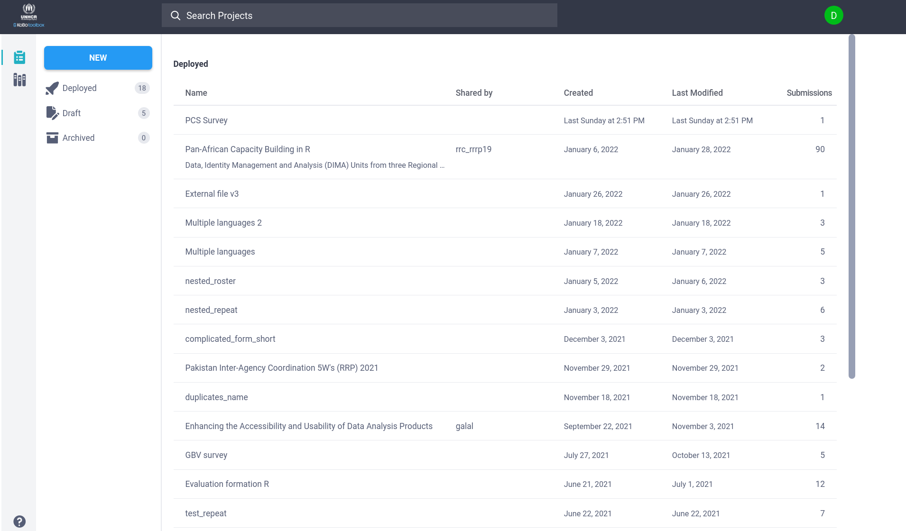

```{r, include = FALSE}
knitr::opts_chunk$set(
  collapse = TRUE,
  message = FALSE,
  warning = FALSE,
  echo = TRUE,
  comment = "#>"
)

```

`robotoolbox` is an R client for retrieving data from [`KoboToolbox`](https://www.kobotoolbox.org).

`robotoolbox` uses [`KoboToolbox API v2`](https://support.kobotoolbox.org/api.html) with the primary aim of simplifying the process of accessing your collected data.

# Configure robotoolbox

In order to use `robotoolbox`, you need to configure and specify your **API token** and your `KoboToolbox` **server URL**. An API token is a unique identifier that acts like a combination of username and password. It allows the user to authenticate to `KoboToolbox` API to access your data. The simplest way to configure `robotoolbox` is to store your API token and server URL in your `.Renviron` file.

We use the environment variables `KOBOTOOLBOX_URL` and `KOBOTOOLBOX_TOKEN` for the URL and the token, respectively. You can use the `usethis` package and the `usethis::edit_r_environ()` function to add these environment variables to your `.Renviron` file.

The following examples will utilize UNHCR `KoboToolbox` server url (https://kobo.unhcr.org/). You can replace this URL by the one you use, it can be https://kf.kobotoolbox.org/, https://kobo.humanitarianresponse.info/ or any other `KoboToolbox` server URL you typically use.

```{bash, eval = FALSE, engine = "sh"}
KOBOTOOLBOX_URL="https://kobo.unhcr.org/"
KOBOTOOLBOX_TOKEN=xxxxxxxxxxxxxxxxxxxxxxxxxx
```

In an interactive session, you can directly use the `kobo_setup` function.

```{r, eval = FALSE}
library(robotoolbox)
kobo_setup(url = "https://kobo.unhcr.org",
           token = "xxxxxxxxxxxxxxxxxxxxxxxxxx")
```

You can manually retrieve your `token` through the `KoboToolbox` account settings in the web interface. There is also a `kobo_token` function to do the same thing automagically from `R`.

```{r, eval = FALSE}
token <- kobo_token(username = "cool_user_name",
                    password = "gRe@TP@$$WoRd",
                    overwrite = TRUE)
```

You can then use this token in your `.Renviron` or during the setup using `kobo_setup`.

```{r, eval = FALSE}
kobo_setup(url = "https://kobo.unhcr.org",
           token = token)
```

You can verify the settings using the `kobo_settings` function.

```{r, eval = FALSE}
kobo_settings()
## <robotoolbox settings>
##    KoboToolbox URL: https://kobo.unhcr.org/
##    KoboToolbox API Token: xxxxxxxxxxxxxxxxxxxxxxxxxx
```

# KoboToolbox API assets

## List your projects

You can view and list all your `KoboToolbox` projects (also known as `assets`) through the web interface.

```{r, echo = FALSE}

```

With `robotoolbox`, you can achieve a similar outcome in `R` using `kobo_asset_list` function.

```{r, echo = FALSE}
library(robotoolbox)
library(dplyr)
asset_list <- robotoolbox::asset_list
```

```{r, eval = FALSE}
library(robotoolbox)
library(dplyr)
asset_list <- kobo_asset_list()

asset_list |>
  slice_head(n = 6) |>
  knitr::kable()
```

```{r, echo = FALSE}
asset_list |>
  slice_head(n = 6) |>
  knitr::kable()
```

## KoboToolbox asset

You can also manipulate directly each `asset` (project) using the `kobo_asset` function. On the server, an asset is uniquely identified by a `uid`.

```{r, eval = FALSE}
uid <- "aYuTZn9vegi3Z49MXwKjep"
asset <- kobo_asset(uid)
asset
```

```{r, echo = FALSE}
asset <- robotoolbox::asset_ml
asset
```

As `asset_list` is a `data.frame` containing the list of assets, we can subset it and select the `uid` of interest based on the available metadata.

As an example, you can get the `uid` associated to the asset (survey) named `Multiple languages`.

```{r, eval = FALSE}
asset_list |>
  filter(name == "Multiple languages") |>
  pull(uid)
```

```{r, echo = FALSE}
asset_list |>
  filter(name == "Multiple languages") |>
  pull(uid)
```

You can then retrieve the associated `asset` object using the `kobo_asset` function.

```{r, eval = FALSE}
asset_list |>
  filter(name == "Multiple languages") |>
  pull(uid) |>
  kobo_asset()
```

```{r, echo = FALSE}
asset
```

A `kobo_asset` provides basic information about your project. You can easily get the name, its type (survey), the number of submissions, when the project was created, and when it was last modified.

# KoboToolbox data

The `kobo_data` function (or its alias `kobo_submissions`) is the main function in `robotoolbox`, and it fetches your data from the server, as its name suggests.

We can illustrate its usage by trying to read data from the same survey named `Multiple languages`.

We can follow the steps mentioned above to get the `uid`, and the `asset`.

```{r, eval = FALSE}
asset_ml <- asset_list |>
  filter(name == "Multiple languages") |>
  pull(uid) |>
  kobo_asset()
asset_ml
```

```{r, echo = FALSE}
asset
```

Then, we can use the `asset_ml` object, which uniquely identifies the `Multiple languages` asset, to read its data

```{r, echo = FALSE}
data_ml <- robotoolbox::data_ml_default
```

```{r, eval = FALSE}
data_ml <- kobo_data(asset_ml)

data_ml |>
  select(start:uuid) |>
  slice_head(n = 3) |>
  knitr::kable()
```

```{r, echo = FALSE}
data_ml |>
  select(start:uuid) |>
  slice_head(n = 3) |>
  knitr::kable()
```

# KoboToolbox form

`robotoolbox` allows you to display and manipulate `KoboToolbox` survey forms. You can pull the form from a particular survey using the `kobo_form` function

```{r}
asset_ml |>
  kobo_form() |>
  knitr::kable()
```

Which is a representation in `robotoolbox` of the following form


- **Survey questions**

| type             | name      | label::English (en)  | label::Francais (fr)               | label::Arabic (ar)  |
|:-----------------|:----------|:---------------------|:-----------------------------------|:--------------------|
| start            | start     |                      |                                    |                     |
| end              | end       |                      |                                    |                     |
| today            | today     |                      |                                    |                     |
| text             | full_name | What is your name?   | Quel est votre nom ?               | ما اسمك ؟           |
| select_one yesno | pet_yesno | Do you have any pet? | Avez-vous un animal de compagnie ? | هل تمتلك حيوانا أليفا ؟ |


- **Choices**

| list_name | name | label::English (en) | label::Francais (fr) | label::Arabic (ar) |
|:----------|-----:|:--------------------|:---------------------|:-------------------|
| yesno     |    1 | Yes                 | Oui                  | نعم                |
| yesno     |    0 | No                  | Non                  | لا                 |
|           |      |                     |                      |                    |


# Wrapping up

`robotoolbox` is a powerful R client for interfacing with the `KoboToolbox`. Its primary purpose is to simplify and streamline the process of accessing and managing data collected through `KoboToolbox`. With the use of functions like `kobo_setup`, `kobo_asset`, and `kobo_data`, users can effortlessly configure their settings, manipulate their projects (or `assets`), and load their data directly from the server. It also comes with utilities to manipulate audit log data for automatic survey data quality control (`kobo_audit`) or to download media attachments (`kobo_attachment_download`).

Overall, `robotoolbox` serves as an essential tool for researchers and data analysts who rely on `KoboToolbox` for data collection and seek an efficient way to integrate their work with the R environment.
